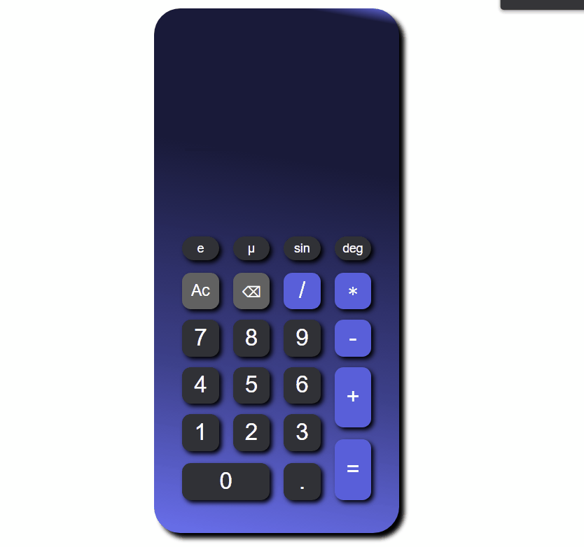

# Calculator 

 Do your calculations on a great calculator 

<h2 align="left"> 📃 Project 🚧 under construction... 🚧</h2>
                  

<h3>A simple calculator that contains all basic arithmetic operations.</h3>
                  
* Addition
* Subtraction
* Multiplication
* Division

<h3>📑 Implementations to do:</h3>

* Button " e "
* Button " µ "
* Button " sin "
* Button " deg "

<h2>🛠 &nbsp;Technologys</h2>

  
  
  

   

<h2>📷 Demonstration</h2>
 

 

  

<h2 align="center" >Calculator link 👇</h2>

  https://exodogurgel.github.io/Calculator/

